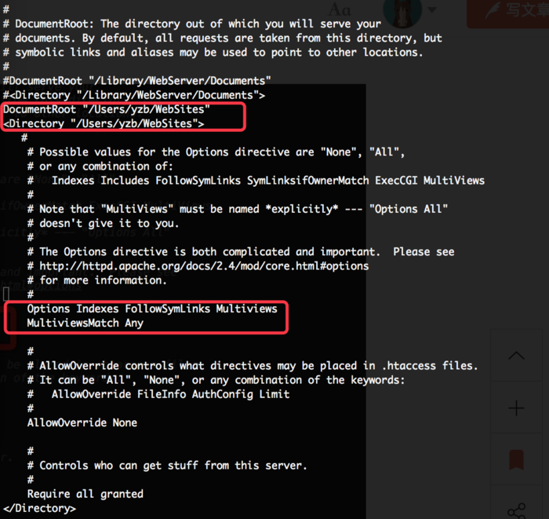
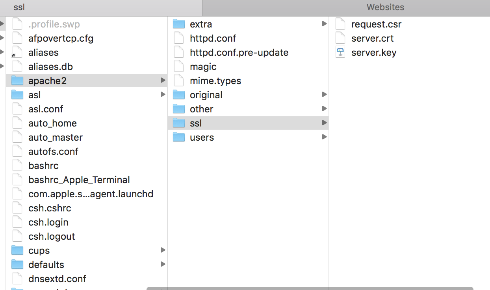
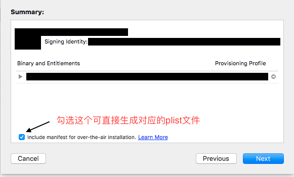
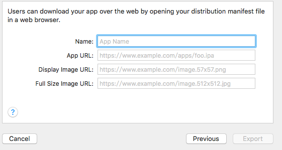
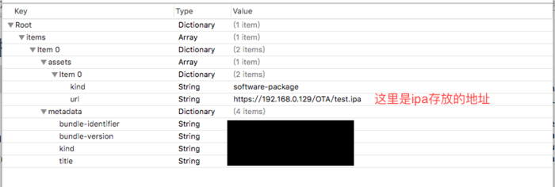
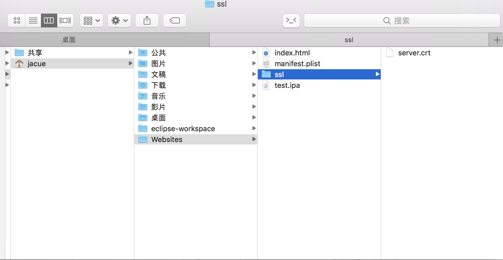

# MacOS 通过OTA分发应用


## 1、启动服务器
macOS 自带apache服务，所以终端输入 sudo apachectl start ，浏览器输入 http://127.0.0.1，如果出现
```
It Works!，OK
```
服务器启动成功。

## 2、修改配置
服务器默认目录"/Library/WebServer/Documents/"，编辑"/etc/apache2/httpd.conf "，找到
```
DocumentRoot "/Library/WebServer/Documents"

<Directory "/Library/WebServer/Documents">
```
改为你想作为服务器根目录的路径（如/Users/jacue/Websites）。
其他修改如下图：



## 3、OpenSSL自制证书

####（1）生成服务器的私钥
```
mkdir /private/etc/apache2/ssl
cd /private/etc/apache2/ssl
sudo openssl genrsa -out server.key 1024
```

####（2）生成证书请求文件
```
sudo openssl req -new -key server.key -out request.csr
```
在设置信息的时候要注意 Common Name 一定要对应服务器地址

####（3）生成ssl证书（有效期为一年）
```
sudo openssl x509 -req -days 365 -in request.csr -signkey server.key -out server.crt
```



## 4、配置apache

####（1）httpd.conf
打开 /private/etc/apache2/httpd.conf 文件，查找以下配置，去掉前面的 “#”：
```
LoadModule ssl_module libexec/apache2/mod_ssl.so
Include /private/etc/apache2/extra/httpd-ssl.conf
Include /private/etc/apache2/extra/httpd-vhosts.conf
LoadModule socache_shmcb_module libexec/apache2/mod_socache_shmcb.so
```


####（2）httpd-ssl.conf
打开 /private/etc/apache2/extra/httpd-ssl.conf 文件
配置ssl证书和密钥的路径
```
SSLCertificateFile "/private/etc/apache2/ssl/server.crt"
SSLCertificateKeyFile "/private/etc/apache2/ssl/server.key"
```

####（3）httpd-vhosts.conf
打开 /private/etc/apache2/extra/httpd-vhosts.conf 文件
在文件的最后面添加以下信息（其中**ServerName 服务地址 ** ，**DocumentRoot一般apache的文件都在/Library/WebServer/Documents/**）
```
<VirtualHost *:443>
SSLEngine on
SSLCertificateFile /private/etc/apache2/ssl/server.crt
SSLCertificateKeyFile /private/etc/apache2/ssl/server.key
ServerName localhost
DocumentRoot "这里填写文件的存储路径"
</VirtualHost>
```

#### 5、验证配置
```
sudo apachectl configtest
```

#### 6、启动或重启apache
```
sudo apachectl restart
```
现在就可以通过https访问apache服务了，不过由于是自签名的会有安全警告，手动设置信任就行了。


# OTA部署
在打包的过程中，到下面这步的时候，如果勾选下图的选择框会引导生成OTA所需要的plist文件


点击next之后会出现如下界面，进行相关信息的填写，下面的四项都是必填项


对于图片有的可能会不需要，并且在plist 文件中没有图片也不影响功能的实现，所以随便就可以，这些信息后期都可以通过修改plist文件来改变。
利用Xcode自动生成的好处就是省去了自己构建plist结构的过程，如果你已经有现成的plist文件就不用勾选第一幅图的选择框，只用修改相应的内容就可以了。
现在我们已经有了https的服务器、ipa安装包和plist文件，OTA所需要的东西已经齐全，剩下的就是将ipa和plist文件方法到服务端，提供下载安装。


apache服务的默认文件位置在/Library/WebServer/Documents/，可在上面的步骤2中修改路径如下


index.html的内容，两个连接，一个下载安装包，一个现在ssl的证书

```
<!DOCTYPE html>
<html>
<head>
<meta charset="utf-8" mime-types="text/plain">
<title></title>
</head>
<body>
<a classstyle="display:block" href="itms-services://?action=download-manifest&url=https://172.20.10.2/manifest.plist">下载ipa</a>
<a style="display:block" href="https://172.20.10.2/ssl/server.crt">下载证书</a>
</body>
</html>
```

其中，test.ipa为最新打的包（可结合jenkins），server.crt为上面步骤3（3）中生成的供客户端安装的证书。


# 客户端安装测试

手机跟电脑在同一个局域网内，手机访问服务器的页面，先点击安装SSL证书，安装证书，然后在设置——>通用——>描述文件，设置刚才安装的证书为信任。接下来最重要的一步，设置——>通用——>关于本机，最下面的证书信任设置，再次设置信任。这个时候再返回网页才能下载安装app。否则会出现"无法连接***"。测试没有问题，进行下一步。


